# Fitness Adventure 🏋️‍♂️🎮🎉

**Fitness Adventure** is a gamified fitness tracker built using **PHP + MySQL**.  
It keeps you motivated with **quests, XP, streaks, progress tracking, and Party mode** – where you can team up with friends for shared goals.  

---

## 🚀 Features

- **Authentication**
  - User login & session management (`login.html`, `signup.html`, `logout.php`)
- **Dashboard (`dashboard.php`)**
  - Personalized user view after login
  - Navigation to profile, quests, and parties
- **Profile (`profile.php`)**
  - Edit personal details (age, height, weight, goals, preferences)
  - Change avatar (with upload support)
  - View locked role field (admin/user)
- **Quests (`quests.php`)**
  - Daily/weekly quests for fitness activities
  - Track completion & earn XP
- **Gamification**
  - XP system and target goals
  - Streak tracking for consistency
- **Party System (`party.php`)**
  - Create or join a party with friends
  - Shared quest progress & streaks
  - Team leaderboard for fun competition
- **Database (`fitness_db`)**
  - `users` → stores profile & login info  
  - `quests` → fitness quests list  
  - `progress` → XP, streaks, goal tracking  
  - `parties` → stores party groups  
  - `party_members` → links users to their party  

---

## 📂 Project Structure

## 📂 Project Structure

fitness-adventure/
├─ Screenshots/ (UI previews)
│  ├─ dashboard.png
│  ├─ index.png
│  ├─ leaderboard1.png
│  ├─ leaderboard2.png
│  ├─ login.png
│  ├─ party.png
│  ├─ profile1.png
│  ├─ profile2.png
│  ├─ quest.png
│  ├─ signup1.png
│  ├─ signup2.png
│  ├─ signup3.png
│  ├─ avatarselect.png
│  └─ welcome.png
│
├─ fitness_db.sql
├─ index.html
├─ dashboard.php
├─ profile.php
├─ leaderboard.php
├─ onboarding.php
├─ welcome.php
├─ login.html
├─ login.php
├─ signup.html
├─ signup.php
├─ logout.php
├─ logout1.php
├─ quests.php
├─ reset_quests.php
├─ update_quest.php
├─ update_monthly_quest.php
├─ party.php
└─ party_actions.php


---

## 📸 Screenshots with Descriptions

### 🔑 Authentication
- **Login Page**  
  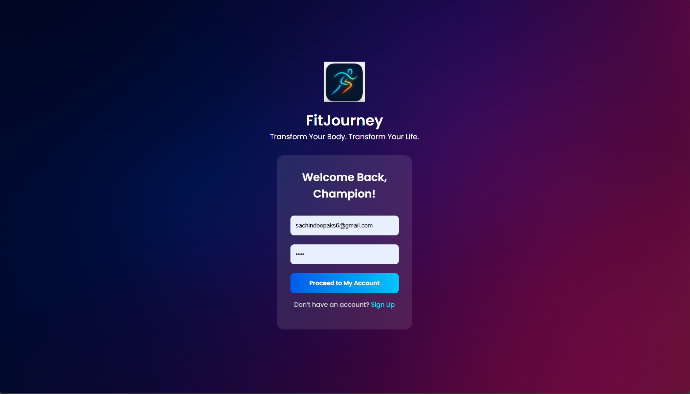  
  _Simple login form where users enter email and password to access their dashboard._  

- **Signup Step 1**  
  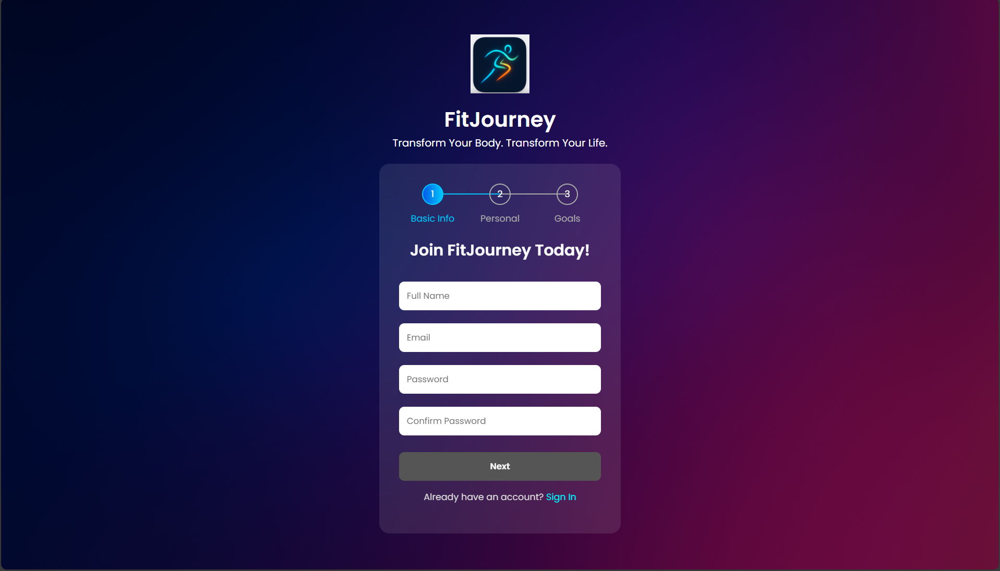  
  _User details collection – basic info like name, email, and password._  

- **Signup Step 2**  
  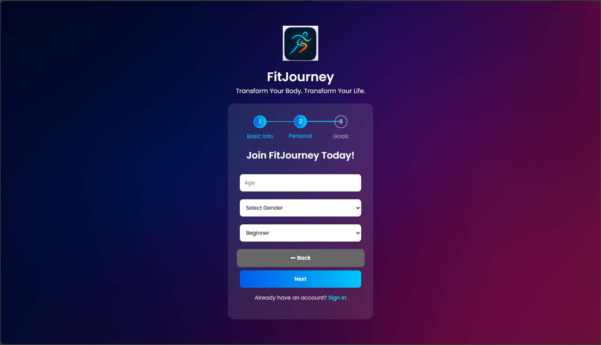  
  _Additional profile setup – age, height, weight, and fitness goals._  

- **Signup Step 3**  
  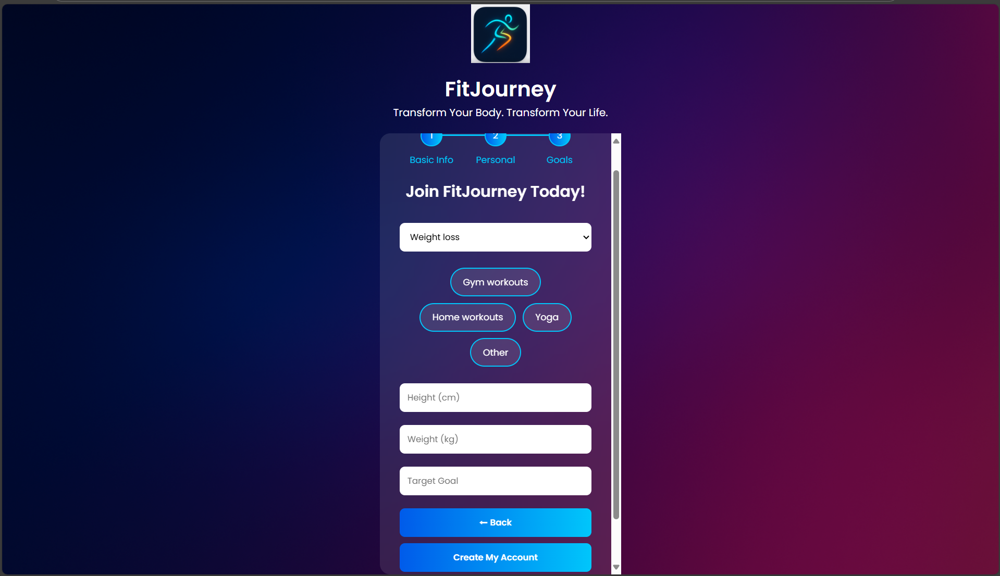  
  _Final setup step – confirmation and onboarding into the fitness journey._  

- **Avatar Select**  
  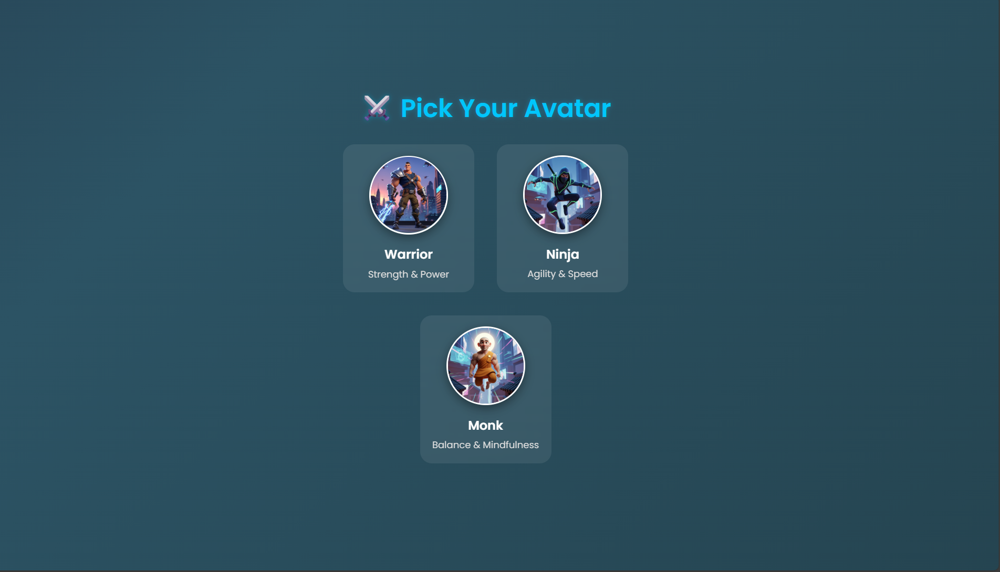  
  _Choose your avatar to represent your fitness journey._  

- **Welcome Page**  
  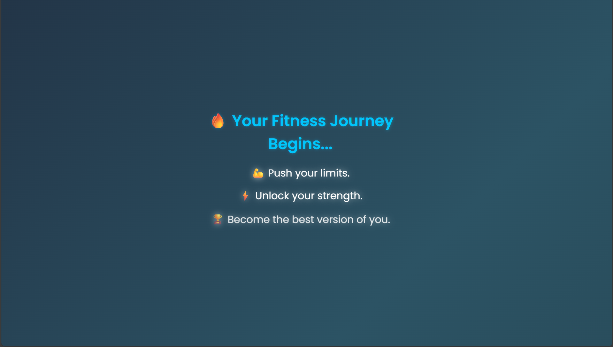  
  _Warm welcome screen after signup completion._  

---

### 🏠 Dashboard & Profile
- **Dashboard**  
  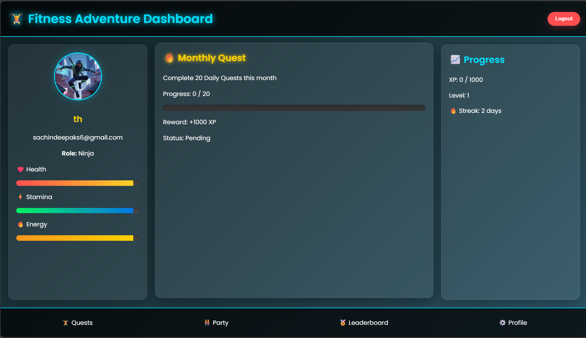  
  _Main hub after login – shows quick stats, navigation to quests, party, and profile._  

- **Profile Page (Info View)**  
  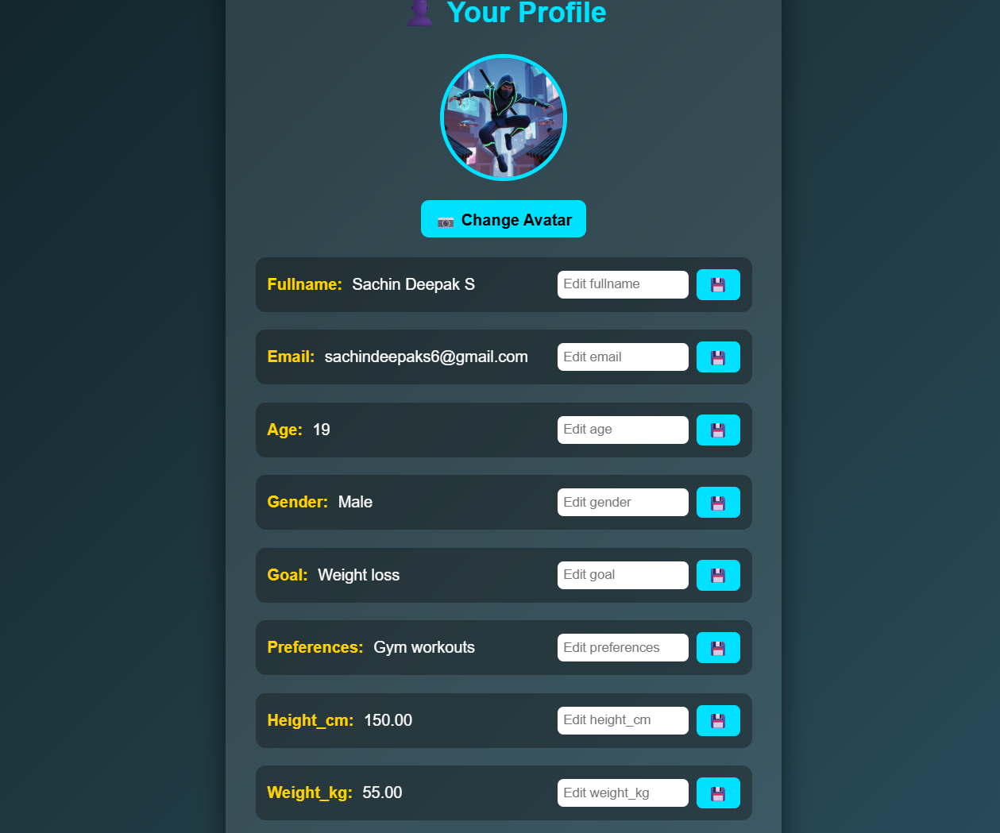  
  _Displays user details like name, age, weight, and fitness goals with avatar._  

- **Profile Page (Edit Mode)**  
  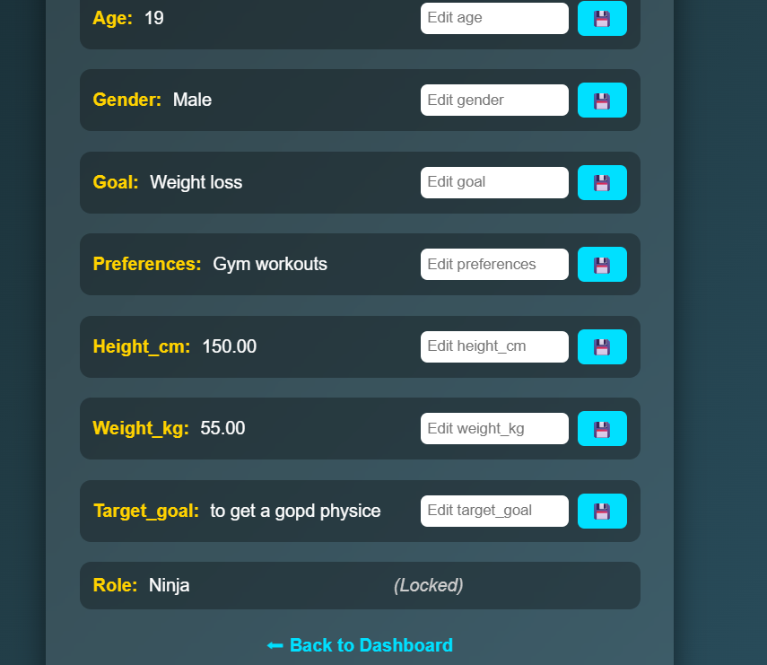  
  _Editable form to update profile info and upload a new avatar image._  

---

### 🎯 Quests & Party
- **Quests**  
  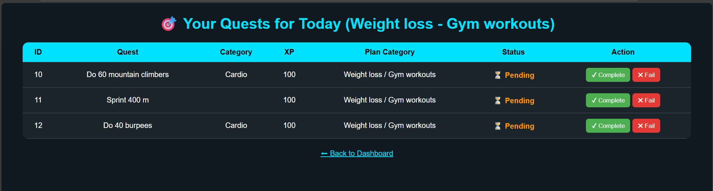  
  _Daily and weekly fitness challenges where users can mark completion and earn XP._  

- **Party System**  
  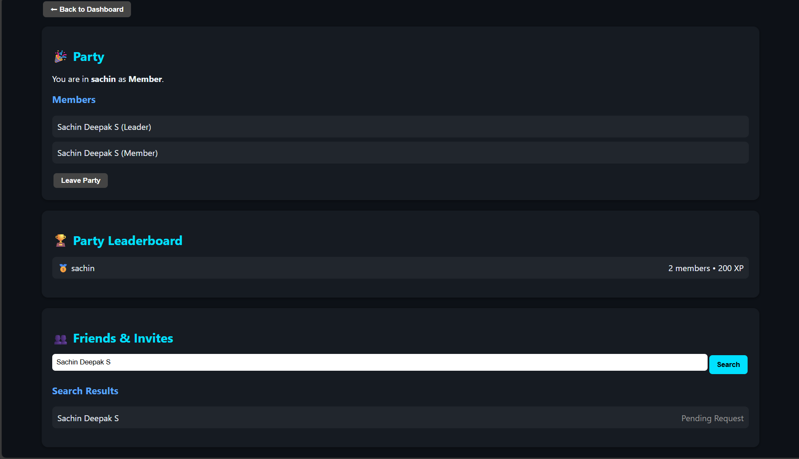  
  _Collaborative party feature – users can create, join, or manage fitness parties._  

---

### 🏆 Leaderboard
- **Leaderboard (Top users)**  
  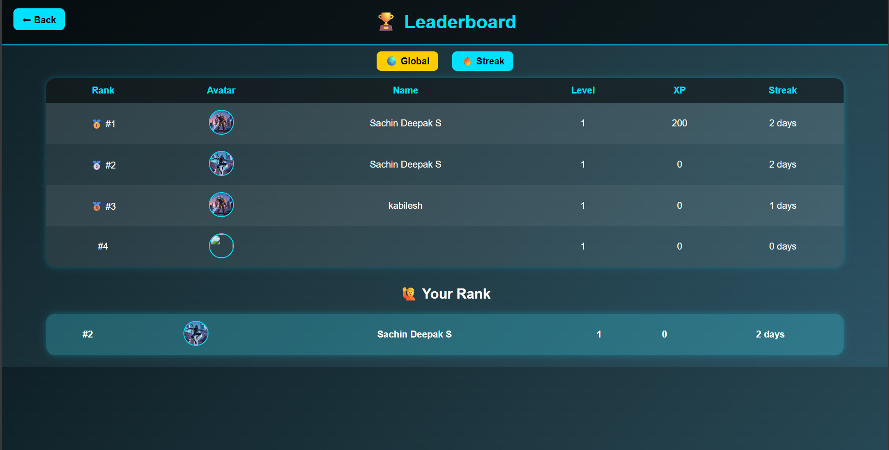  
  _Shows ranking of top users based on XP and streaks._  

- **Leaderboard (Extended view)**  
  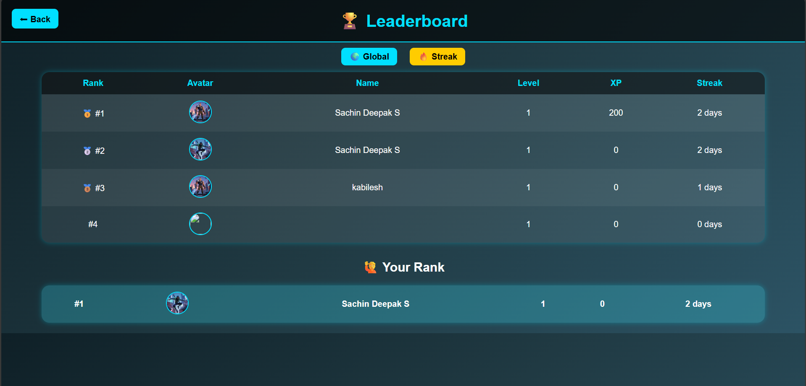  
  _Detailed leaderboard view with more user stats for comparison._  

---

## ⚡ Installation & Setup

1. Clone the repository:
   ```bash
   git clone https://github.com/yourusername/fitness-adventure.git
   cd fitness-adventure
2. Import database:

Create a database fitness_db

Import the provided fitness_db.sql

3. Update DB connection settings in PHP files:

php
Copy code
$servername = "localhost";
$username   = "root";
$password   = "1234"; 
$dbname     = "fitness_db";
$port       = 3307;
4. Run on local server:

Place folder inside htdocs/ (XAMPP)

Start Apache + MySQL in XAMPP

Visit: http://localhost:3307/fitness-adventure/index.html

🎯 Future Enhancements
Party chat & collaboration feed

Party challenges (e.g., “Collect 500 XP as a team this week”)

Global leaderboard of parties

Mobile-first UI redesign

📜 License
MIT License © 2025
Free to use, modify, and share.
